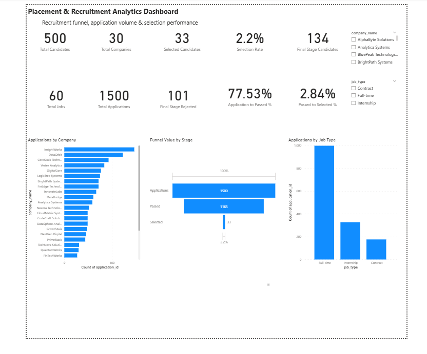
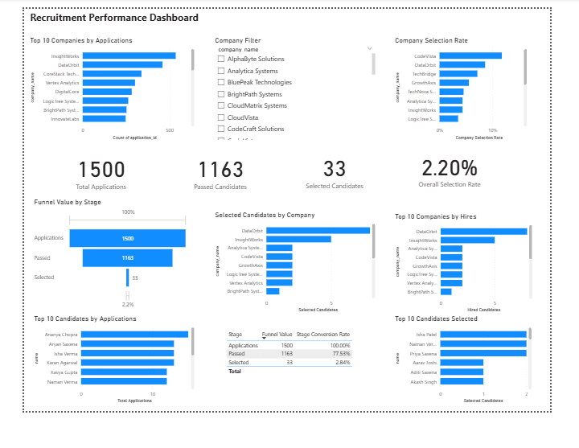

# Placement & Recruitment Analytics

A complete Data Analytics portfolio project analyzing candidate applications, recruitment stages, company hiring activity, and selection performance using **MySQL, Python, Pandas, and Power BI**.

## Project Overview

This project simulates a placement/recruitment analytics environment where candidates apply to jobs across multiple companies.

The analysis focuses on understanding:

- Application volume
- Recruitment funnel performance
- Candidate progression through hiring stages
- Company-wise application and selection performance
- Candidate-wise application activity
- Hiring outcomes
- Selection and conversion rates

The project follows an end-to-end analytics workflow:

**Data Generation → Data Storage → SQL Analysis → Power BI Dashboard → Business Insights**

## Dashboard Preview

### Executive Overview



### Recruitment Performance



---

## Business Questions

The project answers questions such as:

1. How many candidates and companies are involved in the recruitment process?
2. How many applications were submitted?
3. How many candidates passed the recruitment stages?
4. What is the overall candidate selection rate?
5. Which companies received the most applications?
6. Which companies have the highest selection rates?
7. Which companies hired the most candidates?
8. Where are the largest drop-offs in the recruitment funnel?
9. Which candidates submitted the most applications?
10. Which candidates were selected most frequently?

---

## Dataset

The project uses five core datasets:

| Dataset | Description |
|---|---|
| `candidates.csv` | Candidate information |
| `companies.csv` | Company information |
| `jobs.csv` | Job and job-type information |
| `applications.csv` | Candidate job applications |
| `application_stages.csv` | Recruitment stage progression |

### Main Recruitment Funnel

**Applications → Passed → Selected → Hired**

---

## Database Schema

The MySQL database contains six tables:

- Candidates
- Companies
- Jobs
- Applications
- Recruitment_Stages
- Application_Stages

The tables are connected through candidate, company, job, and application relationships.

---

## SQL Analysis

SQL was used to perform recruitment funnel and business analysis.

Key SQL concepts used:

- `JOIN`
- `GROUP BY`
- Aggregate functions
- `CASE`
- Subqueries
- CTEs
- Window functions
- `LAG()`
- Ranking
- Stage-to-stage conversion calculations

Examples of analysis include:

- Company-wise application volume
- Company-wise selection rate
- Top companies by hires
- Recruitment funnel analysis
- Stage conversion rates
- Candidate application activity
- Candidate selection performance

SQL scripts are available in the `/sql` folder.

---

## Python

Python was used to generate and prepare the project dataset.

The data generation script creates realistic recruitment datasets for:

- Candidates
- Companies
- Jobs
- Applications
- Application stages

The script is available in:

`/notebooks/01_generate_recruitment_data.py`

---

## Power BI Dashboard

The Power BI dashboard provides an interactive view of recruitment performance.

### Dashboard KPIs

The dashboard includes:

- Total Candidates
- Total Companies
- Total Jobs
- Total Applications
- Passed Candidates
- Selected Candidates
- Final Stage Candidates
- Final Stage Rejected
- Overall Selection Rate
- Application-to-Passed Conversion
- Passed-to-Selected Conversion

### Dashboard Analysis

The report includes:

- Applications by Company
- Company Selection Rate
- Applications by Job Type
- Recruitment Funnel
- Selected Candidates by Company
- Top Companies by Hires
- Top Candidates by Applications
- Top Candidates Selected

The Power BI file is available in:

`/dashboard/Recruitment_Performance_Analytics.pbix`

---

## Key Findings

The dashboard can be used to identify:

- Companies receiving the highest application volumes
- Companies converting applications into selected candidates most effectively
- Recruitment stages with the largest candidate drop-offs
- Candidates with high application activity
- Companies contributing the most hires
- Overall recruitment funnel efficiency

For example, the current dashboard shows:

- **1,500 total applications**
- **1,163 passed candidates**
- **33 selected candidates**
- **2.20% overall selection rate**
- **77.53% application-to-passed conversion**
- **2.84% passed-to-selected conversion**

These metrics demonstrate that the largest funnel drop-off occurs between the **Passed** and **Selected** stages.

---

## Tools & Technologies

| Tool | Purpose |
|---|---|
| MySQL | Database creation and SQL analysis |
| Python | Data generation |
| Pandas | Data preparation |
| Power BI | Dashboard and visualization |
| Git & GitHub | Version control and project portfolio |

---

## Project Structure

```text
placement-recruitment-analytics/
│
├── dashboard/
│   └── Recruitment_Performance_Analytics.pbix
│
├── data/
│   ├── application_stages.csv
│   ├── applications.csv
│   ├── candidates.csv
│   ├── companies.csv
│   └── jobs.csv
│
├── notebooks/
│   └── 01_generate_recruitment_data.py
│
├── sql/
│   ├── 01_create_database.sql
│   ├── 02_create_tables.sql
│   ├── 03_insert_reference_data.sql
│   └── 03_recruitment_analysis.sql
│
└── README.md